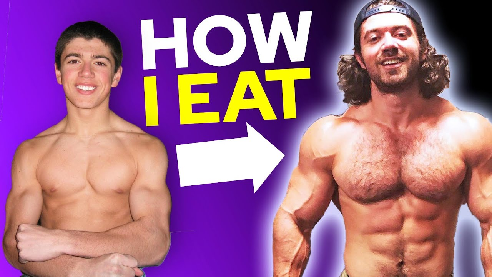

Let's face it, having your own trainer to help keep you motivated
and on track to reach your goals would be amazing, but you don't
have an extra couple hundred to blow on a fancy gym and a personal
coach. You're reading this to learn how to get strong for the least
amount of money possible. So fear not, I'm here to guide you to the
best way to reach your fitness goals on a budget.

## The factors that will make the difference

Like all things in life, putting in the extra effort goes a long way
and exercise is no exception to the rule. There are factors you can
control outside of fitness to maximize your results. I have put
together a list of the ones that are most vital to supporting your
fitness journey. That being said, I strongly recommend putting in
the same amount of effort into these addons if you want to see any
real result. Ignoring them will just result in you fighting against
them yourself in trying to achieve your goals which would be a huge
waste of effort and time.

### Have a clear plan in mind

The most important of which is having a clear goal of what you want
the outcome to be from your effort. Having these goals in mind will
allow you to reverse engineer the outcome you're looking for. That
could be as simple as having an idea of how strong you would like to
look, including the muscle groups you want to improve. Or It could
also be having a picture of the man or woman with your dream
physique so it will always be top of mind. Whatever it is you want
to use it gives you direction on how to train effectively to have
that be your outcome.

Working out only to lose weight is the best example of this.
Many people go to the gym and get a membership that has them
paying for every machine in the gym. When in reality they just
need to burn more calories than they consume a day. Their whole
problem is doing too much in the form of eating excess calories
so they need to do something different if they want different
results. This can be achieved rather cheaply, they simply need
to monitor their intake of calories religiously with - my
favorite app for this is Nutritionix Track. Instead of going to
the gym they could just save their money on the gym membership,
use it to buy some running shoes so they can get out and run. It
isn’t until you really think about your goals that you are able
to think about the best way to get there, that is why I consider
it to be most important.

### Focusing on your diet

A proper diet is vital to lose weight and to gain muscle . This is
true because if your goal is to lose weight it could completely be
done through consuming less calories. So if you want to lose weight,
focusing on your diet should be where you start. The simple rule of
thumb is to consume 500 calories less than your maintenance amount
to lose weight and 500 calories more to gain weight. If you don’t
know your maintenance calorie amount now would be a good time to get
a food scale to track them and if you don't already weigh yourself
daily you should start.

**line 97 - 122 amazon product**

**line 124 - 148 amazon product**

That is all to say that controlling your diet plays a major role in
complementing what you do to get your dream physic. I didn't know it
before but I was making this mistake for much of my life. My body is
very efficient when it comes to burning calories and it does help if
you are very active on top of that. I simply could not hold any
weight and I lacked the calories to really gain the strength I
wanted to. It wasn't until I saw this video by Alex Hormozi that I
understood what I was missing, FOOD AND PROTEIN. Once I changed that
I started to gain muscle for real it was almost magical the
difference I made from such a small tweak. If you have tried diet
after diet to either lose weight or gain muscle watch this video and
only follow it to a tee, you will never take up a flash diet again.

### My $100,000,000 diet...

### The importance of recovery

**line 173 - 206 amazon product+text wrap**

Sleep is often not really thought of when it comes to workout.
Every time you push yourself to the limit you are creating
little micro tears in your muscles. These tears end up healing
into bigger muscles as you give them time to rest, which is why
you feel sore when you exercise properly. So unless you are one
of those sleepwalkers, your sleep time is your real muscles
repair time. always get a good night's rest after exercise. It
will keep your mind sharp and make sure you're growing's
stronger as well.

## Paths to your achieving fitness goals

To get the biggest bang for your buck you need to have a clear plan
in place. By following one of these paths you will be able to form a
plan that works for both your goals and budget This will make it
simpler to break down what it is you should be doing when creating
your workout plan.

### Try out Calisthenics workouts

 Calisthenics is by far the cheapest option for anyone looking to
build serious muscle. The whole principle behind it is working out
with just the weight of your body, allowing you to become very
explosive and gain unreal body control. This may sound limiting but
when you really look into it, it’s a lot more than just push up and
pistol squats. The way people build serious strength with
calisthenics is by working different variations of traditional
workouts like pull ups and push ups to increasingly stress the
muscle group it targets.

 The gains come from the number of reps/sets and the difficulty of
the variation of the exercise you're capable of doing. This differs
from strength training where you really just want to be in a low rep
range close, lifting close to your one rep max. When your body is
your only weight you have to get a little creative. Really, if you
don’t have other equipment that is all you need to get strong. If
you don’t believe me check out [this video.](https://www.youtube.com/watch?v=kuS4iqIq_Xk)

[)](https://www.youtube.com/watch?v=kuS4iqIq_Xk)

### Build your own Home Gym

Making your own home gym is perfect for anyone who doesn’t want to
commute to the gym just to get in shape. It makes it super
convenient to wake up in the morning and get to work. The best part
about it is you always have a reason to just get a little workout
in. It cuts out the hassle of traveling to work out removing the
friction from doing what you should.

Best part about it is you can set it up however you like. If you're
trying to lose some extra weight, make space for an exercise bike
and or a treadmill. If you want to build some muscle get a squat
rack and a bench. The possibilities are endless when you customize
your home gym to your needs.

    Back to what you came for, building serious strength on a budget.
The only equipment you will need is a pair of adjustable dumbbells
and an adjustable bench. With that setup you can work all of your
muscle groups effectively. Your only limit will be how high your max
weight is for your dumbbells set. If you invest in heavy enough
weight you will have a setup that can bring from scrawny to jacked
and never need replacement.

**line 293 - 312 aside-section-recap**

**line 313 - 366 amazon product**

**line 367 - 388 aside-section-recap**

### Get a membership at local gym

 The last option is going to your local commercial gym. If you go to
neighborhood Planet Fitness or Fit4less you can start for as little
as *$16.25 a month.

You will also have so much more options in terms of equipment making
it much better if you are looking for variety and don't have space
for the machines. Keep in mind that if you're just getting started,
having all these options can lead to you wasting a lot of time just
deciding what you want to do or how to do it. Always go to the gym
with a plan or you will end up wasting a lot of time there not
exercising.

**line 404 - 425 aside-section-recap**

Now that concludes my list of best ways to get jacked in on budget.
I want you to know if you want to get strong, just get started.
There is no best way for everyone, for you it may work best to do a
little of them all. But you need to try it out to learn what works
for you.

    *Note: most cheap gyms have an activations fee of $50, so factor
that into your decision. These prices have been given based on my
location so do some research to see what you local offerings are.
